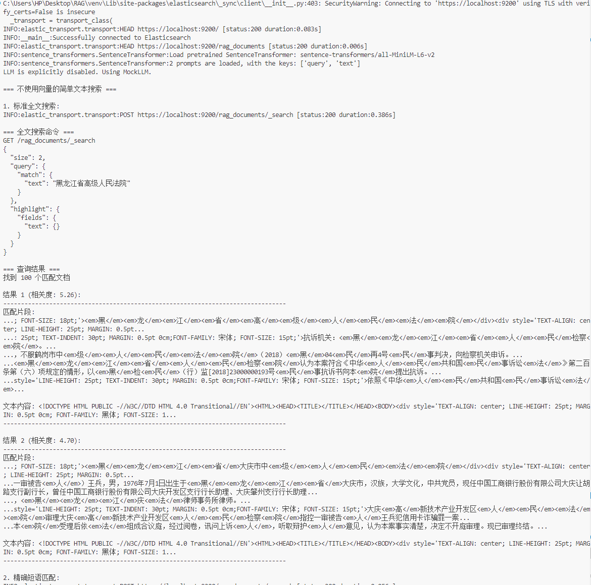

# RAG Elasticsearch 项目

这个项目是一个基于Elasticsearch的检索增强生成(RAG)系统，用于实现高效的文档搜索和问答功能。

## 项目截图

### Elasticsearch查询界面

### 检索结果展示

## 项目说明

本项目使用Elasticsearch存储和索引文档，实现了基于语义的文本检索功能。系统能够对中文文本进行有效的处理和检索。

## 功能特点

- 支持全文搜索和语义匹配
- 提供精确的文档检索能力
- 可以处理大规模文档集
- 支持中文文本

## 使用方法

请参考`rag_elasticsearch`目录下的文档获取详细使用说明。 